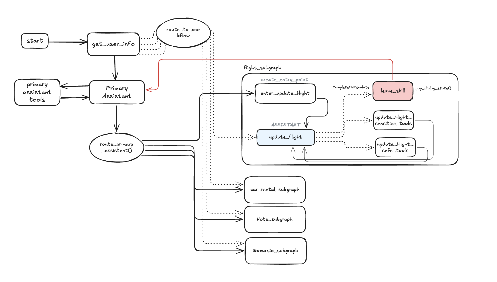

# 🛫 Customer Support Multi Agent AI (Travel)

A multi-workflow customer support AI system built with LangGraph, providing comprehensive assistance for flight management, hotel bookings, car rentals, and trip recommendations.

## 📚 Based on LangGraph Tutorial

This project is an evolution and extension of the original LangGraph customer support tutorial notebook available at: https://github.com/langchain-ai/langgraph/blob/main/docs/docs/tutorials/customer-support/customer-support.ipynb

The implementation has been enhanced with additional features including:
- Multi-workflow conversation management
- Streamlit web interface
- Enhanced human-in-the-loop approval processes
- Comprehensive tool integration
- Production-ready architecture patterns

## 🌟 Features

### 🎯 Multi-Domain Support
- **Flight Management**: Updates, cancellations, rebooking, and schedule modifications
- **Hotel Bookings**: Search, reservation, and accommodation management across price tiers
- **Car Rental Services**: Vehicle booking, modifications, and rental management
- **Trip Recommendations**: Personalized activity suggestions and excursion bookings

### 🏗️ Advanced Architecture
- **LangGraph-Based**: Multi-workflow conversation management with state persistence
- **Specialized Assistants**: Domain-expert AI assistants for each service area
- **Human-in-the-Loop**: Approval workflows for sensitive booking operations
- **Semantic Search**: Policy lookup and FAQ assistance with vector embeddings
- **Memory Management**: Conversation continuity across complex multi-turn interactions

### 🔒 Safety & Compliance
- **Policy Enforcement**: Automated business rule validation and compliance checking
- **Approval Gates**: Human oversight for sensitive operations and financial transactions
- **Error Handling**: Comprehensive fallback mechanisms and graceful degradation
- **Data Privacy**: Secure handling of customer information and booking details

## 🚀 Quick Start

### Prerequisites
- Python 3.8+
- OpenAI API key
- Required Python packages (see `requirements.txt`)

### Installation

1. **Clone the repository**
   ```bash
   git clone https://github.com/your-username/customer_support_ai.git
   cd customer_support_ai
   ```

2. **Install dependencies**
   ```bash
   pip install -r requirements.txt
   ```

3. **Set up environment variables**
   ```bash
   cp .env.example .env
   # Edit .env and add your API keys
   export OPENAI_API_KEY="your-openai-api-key"
   ```

4. **Run the setup**
   ```bash
   python -c "from customer_support_agent.setup import run_full_setup; run_full_setup()"
   ```

5. **Launch the application**
   ```bash
   streamlit run streamlit_app.py
   ```

## 🎮 Usage

### Streamlit Web Interface
The easiest way to interact with the system is through the Streamlit web interface:

```bash
streamlit run streamlit_app.py
```

**🚀 First Time Setup:** When you first run the application, the database and vector store won't exist yet. Simply:

1. Click the **"📥 Download Database"** button to download the SQLite database
2. Click the **"🔄 Initialize Vector Store"** button to create the vector embeddings
3. Or click **"🚀 Complete Setup"** to perform both steps automatically
4. Once setup is complete, you can start chatting with the AI assistant

The setup buttons will only appear when needed and will be disabled once the respective components are properly initialized.

### Command Line Interface
For direct integration or testing:

```python
from customer_support_agent.main_graph import graph

config = {
    "configurable": {
        "passenger_id": "3442 587242",
        "thread_id": "conversation-1"
    }
}

response = graph.invoke(
    {"messages": [("user", "I need to change my flight")]},
    config
)
```

### Example Conversations

**Flight Modification:**
```
User: "I need to change my flight to next week"
AI: "I'll help you update your flight. Let me search for available options..."
```

**Hotel Booking:**
```
User: "I need a hotel in Paris for 3 nights"
AI: "I'll search for hotels in Paris. What's your preferred price range?"
```

**Multi-Service Planning:**
```
User: "Plan my entire trip to Rome - flight, hotel, and activities"
AI: "I'll help coordinate your complete Rome trip across all services..."
```


### Main Graph Flow Architecture



*Figure: Complete system flow showing the main graph architecture with specialized workflows, routing logic, and human-in-the-loop approval processes.*

The system follows a sophisticated multi-workflow architecture where conversations flow through specialized assistants based on user intent and context:

#### **Core Flow Pattern:**
1. **Entry Point** (`start`) → **User Information Gathering** (`get_user_info`)
2. **Primary Assistant Hub** - Central coordinator for all conversations
3. **Workflow Routing** (`route_to_workflow`) - Intelligent delegation to specialized assistants
4. **Specialized Workflow Processing** - Domain-specific assistance with human-in-the-loop approval
5. **Return to Hub** - Seamless transition back to primary assistant for continued conversation

#### **Flight Workflow Details:**
The flight workflow exemplifies the detailed internal structure of each specialized assistant:

- **Entry Point** (`create_entry_point`) - Initializes flight-specific context
- **Flight Assistant** (`enter_update_flight`) - Specialized flight management agent
- **Tool Execution Layer:**
  - **Safe Tools** (`update_flight_safe_tools`) - Non-destructive operations (search, info lookup)
  - **Sensitive Tools** (`update_flight_sensitive_tools`) - Modification operations requiring approval
- **Skill Completion** (`leave_skill`) - Clean return to primary assistant with updated context
- **State Management** - Maintains conversation flow using `pop_dialog_state()` pattern

#### **Multi-Workflow Coordination:**
- **Car Rental Workflow** (`car_rental_subgraph`) - Vehicle booking and management
- **Hotel Workflow** (`hotel_subgraph`) - Accommodation search and reservations  
- **Excursion Workflow** (`excursion_subgraph`) - Activity recommendations and bookings

Each workflow follows the same pattern with entry points, specialized assistants, safe/sensitive tool separation, and controlled exit points, ensuring consistent user experience across all service domains.

#### **Human-in-the-Loop Integration:**
Critical operations (flight changes, bookings, cancellations) are routed through approval gates where users can review and approve/deny proposed actions before execution, maintaining safety and user control throughout the process.

### Core Components

#### 🧠 Main Graph (`main_graph.py`)
Central orchestrator managing conversation flow between specialized assistants:
- **Primary Assistant**: General queries and workflow delegation
- **Workflow Routing**: Intelligent routing between specialized domains
- **State Management**: Conversation context and memory persistence

#### 🔧 Specialized Workflows (`workflows/`)
Domain-specific assistants with expert knowledge:
- **Flight Workflow**: Flight search, updates, cancellations
- **Hotel Workflow**: Accommodation search and booking
- **Car Rental Workflow**: Vehicle rental management
- **Excursion Workflow**: Activity recommendations and bookings

#### 🛠️ Tools & Utilities (`tools.py`, `utils.py`)
Comprehensive toolset for customer operations:
- **Search Tools**: Flight, hotel, car rental, and activity search
- **Booking Tools**: Reservation management and modifications
- **Policy Tools**: Company guidelines and compliance checking
- **Utility Functions**: Database management, error handling, state transitions

#### 🌐 Web Interface (`streamlit_app.py`)
User-friendly interface with:
- **Chat Interface**: Natural conversation experience
- **Setup Management**: Automated system initialization
- **Approval Workflows**: Human oversight for sensitive operations
- **Session Management**: Conversation history and thread handling

## 📚 Documentation

### API Reference
- **Main Graph**: [main_graph.py](customer_support_agent/main_graph.py) - Core conversation orchestration
- **State Management**: [state.py](customer_support_agent/state.py) - Conversation state definitions
- **Routing Logic**: [routing.py](customer_support_agent/routing.py) - Intelligent workflow routing
- **Tools**: [tools.py](customer_support_agent/tools.py) - Customer service tools and operations

### Specialized Assistants
- **Primary Assistant**: [assistants/primary.py](customer_support_agent/assistants/primary.py)
- **Flight Assistant**: [assistants/flight.py](customer_support_agent/assistants/flight.py)
- **Hotel Assistant**: [assistants/hotel.py](customer_support_agent/assistants/hotel.py)
- **Car Rental Assistant**: [assistants/car_rental.py](customer_support_agent/assistants/car_rental.py)
- **Excursion Assistant**: [assistants/excursion.py](customer_support_agent/assistants/excursion.py)

### Workflow Implementations
- **Flight Workflow**: [workflows/flight_workflow.py](customer_support_agent/workflows/flight_workflow.py)
- **Hotel Workflow**: [workflows/hotel_workflow.py](customer_support_agent/workflows/hotel_workflow.py)
- **Car Rental Workflow**: [workflows/car_rental_workflow.py](customer_support_agent/workflows/car_rental_workflow.py)
- **Excursion Workflow**: [workflows/excursion_workflow.py](customer_support_agent/workflows/excursion_workflow.py)

## 🛡️ Safety Features

### Human-in-the-Loop Approval
The system implements approval workflows for sensitive operations:
- **Flight Modifications**: Rebooking, cancellations, schedule changes
- **Hotel Bookings**: Reservations, modifications, cancellations
- **Car Rental Bookings**: Vehicle reservations and changes
- **Financial Transactions**: Any operation involving payments or fees

### Business Rule Enforcement
- **Policy Compliance**: Automated checking against company policies
- **Time Constraints**: Minimum lead times for flight changes (3-hour rule)
- **Validation**: Customer ownership verification for all modifications
- **Error Handling**: Graceful fallbacks and informative error messages

## 🔧 Configuration

### Environment Variables
```bash
# Required API Keys
OPENAI_API_KEY=your-openai-api-key
ANTHROPIC_API_KEY=your-anthropic-api-key  # Optional, for Claude models

# Optional Configuration
TAVILY_API_KEY=your-tavily-api-key  # For web search functionality
```

### System Settings
- **Database**: SQLite travel database with flight, hotel, and rental data
- **Vector Store**: OpenAI embeddings for semantic policy search
- **Memory**: Persistent conversation state with checkpointing
- **Interrupts**: Human approval points for sensitive operations

## 🧪 Testing

### Run Tests
```bash
python customer_support_agent/test_all_workflows.py
```

### Manual Testing
Use the included test scenarios in `run.py`:
```bash
python customer_support_agent/run.py
```

## 🤝 Contributing

1. Fork the repository
2. Create a feature branch (`git checkout -b feature/amazing-feature`)
3. Commit your changes (`git commit -m 'Add amazing feature'`)
4. Push to the branch (`git push origin feature/amazing-feature`)
5. Open a Pull Request

### Development Guidelines
- Follow the existing code structure and patterns
- Add comprehensive documentation for new features
- Include tests for new functionality
- Ensure all tools have proper error handling
- Maintain the human-in-the-loop approval patterns for sensitive operations

## 📄 License

This project is licensed under the MIT License - see the [LICENSE](LICENSE) file for details.

## 🙏 Acknowledgments

- **LangGraph**: For the powerful workflow orchestration framework
- **LangChain**: For the comprehensive AI application development tools
- **OpenAI**: For language models and embedding capabilities
- **Streamlit**: For the intuitive web interface framework

## 🤖 AI-Generated Documentation

**Note:** This README and the comprehensive code comments throughout the project have been automatically generated using AI assistance. The documentation aims to provide clear, detailed explanations of the system architecture, usage patterns, and implementation details to help developers understand and extend the codebase effectively.

## 📞 Support

For questions, issues, or feature requests:
- **Issues**: [GitHub Issues](https://github.com/your-username/customer_support_ai/issues)
- **Documentation**: [Project Wiki](https://github.com/your-username/customer_support_ai/wiki)
- **Discussions**: [GitHub Discussions](https://github.com/your-username/customer_support_ai/discussions)

